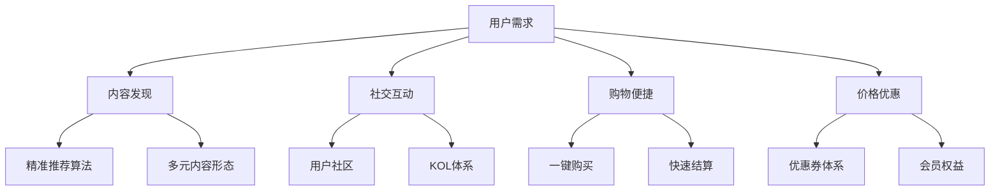

# 零售电商 App - 完整项目需求文档

## 目录

1. [项目概述与竞品分析](#1-项目概述与竞品分析)
2. [前台功能详细设计](#2-前台功能详细设计)
3. [后台管理系统](#3-后台管理系统)
4. [技术架构设计](#4-技术架构设计)
5. [数据库设计](#5-数据库设计)
6. [API 接口文档](#6-api接口文档)
7. [部署运维方案](#7-部署运维方案)
8. [项目排期与里程碑](#8-项目排期与里程碑)

---

## 1. 项目概述与竞品分析

### 1.1 项目背景

**项目名称**: 零售电商 App
**项目定位**: 面向年轻消费者的社交化电商平台,融合内容种草、直播电商、即时购物于一体
**核心理念**: "发现-种草-购买"的闭环体验,打造新一代内容驱动型电商平台

### 1.2 目标用户画像

| 维度         | 描述                                   |
| ------------ | -------------------------------------- |
| **年龄层**   | 18-35 岁,Z 世代和千禧一代为主          |
| **性别分布** | 女性 65%,男性 35%                      |
| **消费特征** | 注重品质、追求个性化、易受 KOL 影响    |
| **使用场景** | 碎片化时间浏览、冲动消费、社交分享     |
| **核心需求** | 发现新品、获取优惠、快速下单、内容娱乐 |

### 1.3 竞品分析

#### 竞品对比矩阵

| 平台         | 优势                                  | 劣势                               | 核心特色      | 市场份额         |
| ------------ | ------------------------------------- | ---------------------------------- | ------------- | ---------------- |
| **小红书**   | 内容社区强大、用户粘性高、UGC 丰富    | 电商转化率相对较低、商家生态待完善 | 种草笔记+电商 | 社交电商领域 30% |
| **淘宝**     | 商品 SKU 最全、供应链成熟、用户基数大 | 内容化转型缓慢、年轻用户流失       | 传统电商巨头  | 综合电商 52%     |
| **抖音电商** | 短视频流量巨大、直播带货强、算法精准  | 用户购物目的性弱、退货率高         | 兴趣电商      | 内容电商 45%     |
| **得物**     | 正品鉴定、潮流文化、社区氛围          | 品类相对单一、价格偏高             | 潮流电商+鉴定 | 垂直领域 60%     |
| **拼多多**   | 价格优势、下沉市场、社交裂变          | 品质参差不齐、用户体验一般         | 社交拼团      | 下沉市场 58%     |

#### 核心价值提取

基于 TOP5 竞品分析,我们的差异化策略:



**差异化核心要素**:

1. **内容+电商双引擎**: 借鉴小红书的内容种草能力 + 淘宝的电商基础设施
2. **直播+短视频双驱动**: 参考抖音的直播带货模式 + 优化转化路径
3. **会员+积分双激励**: 学习得物的用户粘性体系 + 创新积分玩法
4. **个性化推荐**: 基于 AI 算法的千人千面推荐,提升转化率
5. **无缝购物体验**: 从内容到下单 3 步完成,降低决策成本

### 1.4 市场机会分析

| 机会点       | 市场规模   | 增长率     | 切入策略                           |
| ------------ | ---------- | ---------- | ---------------------------------- |
| **内容电商** | 3.2 万亿元 | 年增长 35% | 打造优质内容生态,建立 KOL 合作体系 |
| **直播电商** | 1.5 万亿元 | 年增长 42% | 引入品牌直播间,提供技术支持工具    |
| **会员经济** | 8000 亿元  | 年增长 28% | 设计多层级会员体系,提供差异化权益  |
| **社交裂变** | 5000 亿元  | 年增长 50% | 开发邀请机制、拼团功能、分享奖励   |

### 1.5 关键成功因素

**产品层面**:

- ✅ 流畅的用户体验(加载速度<2s,操作步骤<3 步)
- ✅ 精准的内容推荐(点击率>15%,转化率>8%)
- ✅ 丰富的商品 SKU(初期 5000+,半年后 20000+)
- ✅ 完善的售后体系(7 天无理由退换,48 小时客服响应)

**运营层面**:

- ✅ 优质 KOL 引入(初期 100+达人,半年后 1000+)
- ✅ 品牌商家合作(初期 50+品牌,半年后 200+)
- ✅ 营销活动策划(每月至少 2 次大促,每周 1 次小促)
- ✅ 用户增长策略(月活增长率>20%,留存率>40%)

**技术层面**:

- ✅ 高可用架构(系统可用性 99.9%)
- ✅ 数据安全保障(通过等保三级认证)
- ✅ 性能优化(并发支持 10 万+,响应时间<200ms)
- ✅ 智能推荐系统(基于用户行为的实时推荐)

---

## 2. 前台功能详细设计

### 2.1 整体架构

**页面结构图**:

```
零售电商App
├── 首页 (HomePage)
│   ├── 搜索栏
│   ├── 轮播横幅
│   ├── 金刚区(快捷入口)
│   ├── 直播热卖
│   ├── 限时秒杀
│   └── 商品推荐(瀑布流)
├── 发现 (DiscoverPage)
│   ├── 分类Tab
│   ├── 内容流(图文/视频)
│   ├── 用户互动(点赞/评论)
│   └── 商品链接区
├── 购物车 (CartPage)
│   ├── 商品列表
│   ├── 优惠券入口
│   ├── 猜你喜欢
│   └── 结算栏
├── 我的 (ProfilePage)
│   ├── 用户信息卡
│   ├── 会员中心
│   ├── 订单追踪
│   ├── 资产管理
│   └── 功能菜单
└── 商品详情 (ProductDetail) [待开发]
    ├── 商品轮播图
    ├── 价格与促销信息
    ├── 规格选择
    ├── 用户评价
    └── 购买按钮
```

### 2.2 首页功能设计

#### 2.2.1 搜索模块

**功能描述**: 全局智能搜索,支持商品、品牌、店铺、内容多维度搜索

**核心特性**:

- 🔍 **智能联想**: 基于用户输入实时显示搜索建议
- 🔥 **热门搜索**: 展示当前热门搜索词,引导用户发现
- 📊 **搜索历史**: 记录用户搜索记录,支持快速访问
- 🎯 **语音搜索**: 支持语音输入,提升便捷性
- 🏷️ **标签过滤**: 搜索结果支持多维度筛选

**交互流程**:

```
用户点击搜索框
  ↓
显示搜索页面(历史记录+热门搜索)
  ↓
用户输入关键词
  ↓
实时显示联想词
  ↓
用户选择/确认搜索
  ↓
展示搜索结果(综合/商品/内容/店铺)
```

#### 2.2.2 轮播横幅

**功能描述**: 首屏运营位,展示重点营销活动、新品上线、品牌合作等

**设计规范**:
| 参数 | 规格 |
|------|------|
| 尺寸 | 750x300px (2.5:1) |
| 数量 | 3-5 张 |
| 切换方式 | 自动轮播(3s 间隔) + 手动滑动 |
| 指示器 | 底部圆点,当前项高亮加宽 |
| 跳转逻辑 | 点击跳转至对应活动页/商品详情 |

**数据埋点**:

- 曝光量(PV)
- 点击率(CTR)
- 转化率(CVR)
- 停留时长

#### 2.2.3 金刚区(快捷入口)

**功能描述**: 8 个核心功能快捷入口,提供一键直达服务

**入口列表**:

1. **每日秒杀** - 跳转至秒杀专场
2. **品牌闪购** - 品牌特卖活动页
3. **直播好物** - 直播列表页
4. **优惠券中心** - 领券中心
5. **会员专属** - 会员权益页
6. **排行榜** - 热销/新品/好评榜单
7. **新品首发** - 新品专区
8. **我的收藏** - 用户收藏列表

**设计要点**:

- 图标使用渐变色,提升视觉吸引力
- 支持配置化管理,可动态调整入口
- 响应式布局: 电脑 4 列,平板 4 列,手机 4 列

#### 2.2.4 直播热卖

**功能描述**: 展示当前正在直播的热门直播间

**展示信息**:

- 直播封面图(竖版,宽高比 9:16)
- 直播状态标签("直播中",红色背景)
- 主播/品牌名称
- 观看人数
- 主推商品标签

**交互逻辑**:

- 横向滚动展示 3-5 个直播间
- 点击进入直播详情页
- 支持预约未开始的直播

#### 2.2.5 限时秒杀

**功能描述**: 限时特价商品专区,营造紧迫感促进转化

**核心元素**:

- 倒计时显示(小时:分钟:秒)
- 秒杀价格(红色突出显示)
- 进度条(已售百分比)
- 秒杀标签

**业务规则**:

- 每日多场次(10:00、14:00、20:00、22:00)
- 每场 3-10 个商品
- 限购规则(每人每款限购 1-2 件)
- 库存实时更新

#### 2.2.6 商品推荐(瀑布流)

**功能描述**: 基于算法的个性化商品推荐,采用瀑布流布局

**布局特点**:

- 两列瀑布流(响应式)
- 图片等宽,高度自适应
- 支持无限滚动加载

**商品卡片信息**:

- 商品主图
- 商品标题(2 行截断)
- 价格(现价+划线原价)
- 销量/评价数
- 标签(秒杀/新品/热卖等)

**推荐算法逻辑**:

```javascript
// 推荐权重计算
const recommendScore =
  userBehaviorScore * 0.4 + // 用户行为(浏览/收藏/购买)
  itemPopularityScore * 0.2 + // 商品热度
  categoryPreferenceScore * 0.2 + // 品类偏好
  timeDecayScore * 0.1 + // 时间衰减
  diversityScore * 0.1; // 多样性
```

### 2.3 发现页功能设计

#### 2.3.1 分类 Tab

**功能描述**: 内容分类导航,支持横向滚动

**分类列表**:

- 推荐(算法推荐,默认选中)
- 关注(关注的博主内容)
- 时尚
- 美食
- 旅行
- 数码
- 家居
- 运动
- 美妆
- 母婴

**交互特性**:

- 选中态下划线动效
- 支持左右滑动切换
- Tab 吸顶效果

#### 2.3.2 内容流

**支持内容类型**:

1. **图文帖子** - 1-9 张图片 + 文字描述
2. **视频帖子** - 短视频(15s-5min) + 文字描述
3. **直播回放** - 直播精彩片段

**内容卡片结构**:

```
┌─────────────────────────────┐
│ 用户头像  用户名      [关注] │
├─────────────────────────────┤
│                             │
│      图片/视频封面           │
│      (4:3或16:9)            │
│                             │
├─────────────────────────────┤
│ 标题(1-2行)                 │
│ 内容摘要(2行截断)           │
├─────────────────────────────┤
│ ❤ 2.3万  💬 356             │
├─────────────────────────────┤
│ [商品卡片]  商品名  ¥299 [购买] │
└─────────────────────────────┘
```

**互动功能**:

- ❤️ 点赞(支持双击快速点赞)
- 💬 评论(点击进入评论详情页)
- ⭐ 收藏
- 🔗 分享(生成海报/复制链接)

#### 2.3.3 商品链接区

**功能描述**: 帖子关联的商品,点击可直接购买

**展示形式**:

- 商品缩略图
- 商品名称
- 价格
- "购买"按钮

**转化路径优化**:

```
内容帖子
  ↓
商品链接卡片
  ↓
点击商品
  ↓
弹出SKU选择器(规格/数量)
  ↓
加入购物车/立即购买
  ↓
结算页
```

### 2.4 购物车功能设计

#### 2.4.1 商品管理

**核心功能**:

- ✅ 全选/单选商品
- ✅ 修改数量(+/-按钮)
- ✅ 删除商品(左滑删除 或 点击删除图标)
- ✅ 编辑模式(批量删除/移入收藏)
- ✅ 失效商品提示(库存不足/已下架)

**状态处理**:
| 状态 | 描述 | 处理方式 |
|------|------|----------|
| 正常 | 商品可购买 | 正常显示,可结算 |
| 库存不足 | 可购数量<购物车数量 | 标记提示,自动调整数量 |
| 已下架 | 商品已删除 | 置灰显示,无法选中 |
| 价格变动 | 价格上涨/下降 | 高亮提示价格变化 |

#### 2.4.2 优惠券系统

**入口位置**: 购物车顶部卡片

**展示信息**:

- 可用优惠券数量
- 最大优惠金额
- 点击进入选券页

**选券页功能**:

- 自动匹配可用券
- 手动输入券码
- 券的适用条件说明
- 自动计算最优组合

**优惠券类型**:
| 类型 | 使用条件 | 示例 |
|------|----------|------|
| 满减券 | 满 XX 元减 XX 元 | 满 300 减 50 |
| 折扣券 | XX 折 | 全场 8.8 折 |
| 品类券 | 指定品类可用 | 美妆类满 200 减 30 |
| 商家券 | 指定商家可用 | XX 品牌满 500 减 80 |
| 新人券 | 新用户专享 | 新人专享立减 20 |

#### 2.4.3 结算模块

**底部结算栏信息**:

```
┌────────────────────────────────┐
│ 已优惠: -¥200                   │
├────────────────────────────────┤
│ [√] 全选  合计: ¥1,298  [结算(2)] │
└────────────────────────────────┘
```

**结算流程**:

```
点击结算按钮
  ↓
验证商品状态(库存/价格)
  ↓
跳转确认订单页
  ↓
填写/选择收货地址
  ↓
选择支付方式
  ↓
提交订单
  ↓
调起支付
  ↓
支付成功
  ↓
订单详情页
```

#### 2.4.4 猜你喜欢

**功能描述**: 购物车下方推荐相关商品,促进关联购买

**推荐策略**:

- 基于购物车商品的关联推荐
- 同类目高销量商品
- 用户浏览历史相关
- 搭配推荐(服装配饰、数码配件等)

### 2.5 个人中心功能设计

#### 2.5.1 用户信息卡

**展示内容**:

- 用户头像(支持点击修改)
- 昵称
- 会员等级(普通/银卡/金卡/铂金/钻石)
- 会员积分
- 成长值
- 签到入口

**会员等级体系**:
| 等级 | 成长值要求 | 专属权益 |
|------|-----------|----------|
| 普通会员 | 0-999 | 基础购物权限 |
| 银卡会员 | 1000-4999 | 9.8 折优惠、每月 2 张券 |
| 金卡会员 | 5000-14999 | 9.5 折优惠、每月 5 张券、专属客服 |
| 铂金会员 | 15000-39999 | 9 折优惠、每月 10 张券、优先发货 |
| 钻石会员 | 40000+ | 8.8 折优惠、每月 20 张券、专属活动 |

#### 2.5.2 订单追踪

**订单状态分类**:

1. **待付款** - 已下单未支付(显示剩余支付时间)
2. **待发货** - 已支付待商家发货
3. **待收货** - 已发货在途(显示物流信息)
4. **待评价** - 已收货未评价
5. **退换/售后** - 退货退款、换货、维修

**订单卡片信息**:

- 商品缩略图(最多 3 个)
- 商品数量
- 订单金额
- 订单状态
- 操作按钮(取消/支付/确认收货/评价/查看物流)

#### 2.5.3 资产管理

**资产类型**:
| 资产 | 说明 | 入口功能 |
|------|------|----------|
| 优惠券 | 已领取的优惠券 | 查看全部券、筛选可用/已用/过期 |
| 余额 | 账户余额 | 充值、提现、明细 |
| 收藏 | 收藏的商品和内容 | 分类查看、批量管理 |
| 足迹 | 浏览历史记录 | 按时间查看、删除记录 |

#### 2.5.4 功能菜单

**常用功能列表**:

- 📍 收货地址管理
- ⚙️ 账号设置(修改密码、绑定手机、实名认证)
- 🎧 联系客服(在线客服、电话客服)
- 📄 帮助中心(常见问题、购物指南)
- ⚖️ 服务协议(用户协议、隐私政策)
- ℹ️ 关于我们(版本信息、公司介绍)

### 2.6 商品详情页设计(新增)

#### 2.6.1 页面结构

**顶部区域**:

- 商品图片轮播(支持放大查看)
- 视频介绍(如有)
- 商品标签(包邮/7 天退换/正品保证)

**商品信息区**:

```
┌──────────────────────────────┐
│ 商品标题(2-3行)              │
│ 卖点描述(突出优势)           │
├──────────────────────────────┤
│ ¥599  ¥899  [86折]          │
│ 月销2.3万  好评率99%         │
└──────────────────────────────┘
```

**促销信息区**:

- 限时优惠倒计时
- 满减活动
- 优惠券(领券、优惠券列表)
- 会员价

**规格选择区**:

- 颜色/尺码/版本选择(图片+文字)
- 数量选择
- 库存提示

**商品详情区**:

- 商品参数表格
- 图文详情
- 用户评价(好评/中评/差评筛选)
- 常见问题 Q&A

**底部操作栏**:

```
┌──────────────────────────────┐
│ [客服] [收藏] [加入购物车] [立即购买] │
└──────────────────────────────┘
```

### 2.7 响应式布局设计

#### 2.7.1 断点设置

| 设备类型 | 屏幕宽度       | 布局调整               |
| -------- | -------------- | ---------------------- |
| 手机     | < 768px        | 单列布局,底部 Tab 导航 |
| 平板     | 768px - 1024px | 双列布局,侧边导航      |
| 电脑     | > 1024px       | 多列布局,顶部导航      |

#### 2.7.2 关键适配策略

**首页适配**:

- 手机: 金刚区 4 列,商品瀑布流 2 列
- 平板: 金刚区 4-8 列,商品瀑布流 3-4 列
- 电脑: 金刚区 8 列,商品瀑布流 4-6 列,增加左侧分类导航

**发现页适配**:

- 手机: 单列内容流
- 平板: 双列内容流
- 电脑: 三列内容流,右侧展示推荐榜单

**购物车适配**:

- 手机: 商品信息垂直排列
- 平板: 商品信息水平排列,增加操作空间
- 电脑: 左侧商品列表,右侧结算汇总固定

**个人中心适配**:

- 手机: 单列垂直布局
- 平板: 部分区域双列展示
- 电脑: 左侧导航菜单,右侧内容区

#### 2.7.3 交互优化

**触摸优化**:

- 按钮最小点击区域: 44x44px
- 滑动手势支持(左滑删除、下拉刷新)
- 长按触发菜单

**性能优化**:

- 图片懒加载
- 虚拟滚动(长列表)
- 骨架屏加载
- 路由懒加载

**无障碍设计**:

- 语义化 HTML 标签
- ARIA 属性支持
- 键盘导航支持
- 高对比度模式

---

## 3. 后台管理系统

### 3.1 系统架构

**技术栈**:

- 前端: Vue 3 + Element Plus + TypeScript
- 后端: 共用 API 服务
- 权限: RBAC 基于角色的访问控制

**用户角色**:
| 角色 | 权限范围 | 典型用户 |
|------|---------|----------|
| 超级管理员 | 所有权限 | 系统开发者 |
| 运营管理员 | 内容审核、活动配置、数据分析 | 运营团队 |
| 商品管理员 | 商品上下架、库存管理、订单处理 | 商品团队 |
| 客服 | 订单查询、售后处理、用户咨询 | 客服团队 |
| 数据分析师 | 数据报表查看(只读) | 数据团队 |

### 3.2 功能模块

#### 3.2.1 仪表盘 Dashboard

**核心指标**:

```
┌─────────────────────────────────────────┐
│ 今日概览                                │
├────────┬────────┬────────┬────────┤
│ GMV    │ 订单数  │ 用户数  │ 转化率 │
│ ¥128万 │ 3,245  │ 1,256  │ 8.5%  │
└────────┴────────┴────────┴────────┘
```

**数据图表**:

- 近 30 天 GMV 趋势图(折线图)
- 品类销售占比(饼图)
- 流量来源分布(环形图)
- 热销商品 TOP10(柱状图)

**实时监控**:

- 当前在线用户数
- 实时订单滚动
- 库存预警提示
- 异常订单提醒

#### 3.2.2 商品管理

**商品列表**:

- 搜索: 商品名称/ID/品类
- 筛选: 状态(在售/下架)/品类/品牌/价格区间
- 批量操作: 上架/下架/删除/修改价格

**商品编辑**:

```
基本信息:
- 商品名称*
- 商品分类*
- 品牌
- 商品标签(多选)

价格库存:
- 销售价*
- 市场价
- 成本价
- 总库存*
- SKU管理(颜色/尺码/版本)

商品详情:
- 商品轮播图(最多10张)
- 商品视频
- 详情富文本编辑器
- 商品参数表

营销设置:
- 参与活动(秒杀/满减/拼团)
- 优惠券适用
- 会员价设置
- 限购数量

SEO设置:
- 商品关键词
- 商品描述
- 分享图片
```

**SKU 管理**:
| 颜色 | 尺码 | 库存 | 价格 | 商品编码 |
|------|------|------|------|---------|
| 白色 | S | 100 | ¥599 | SKU001 |
| 白色 | M | 150 | ¥599 | SKU002 |
| 黑色 | S | 80 | ¥599 | SKU003 |

#### 3.2.3 订单管理

**订单列表**:

- 搜索: 订单号/用户手机号/收货人
- 筛选: 订单状态/支付方式/下单时间
- 导出: 支持 Excel/CSV 导出

**订单详情**:

```
订单信息:
- 订单号: 20231211XXXX
- 下单时间: 2023-12-11 14:30:25
- 订单状态: 待发货
- 支付方式: 微信支付

用户信息:
- 用户ID/昵称/手机号
- 收货人: XXX
- 收货地址: XX省XX市XX区XXX

商品信息:
- 商品列表(图片/名称/规格/数量/单价)
- 商品总额: ¥1,298
- 优惠券: -¥100
- 运费: +¥10
- 实付金额: ¥1,208

操作记录:
- 时间轴展示订单流转记录
- 备注信息
- 操作人员

操作按钮:
- [发货] [修改地址] [取消订单] [备注]
```

**发货操作**:

- 选择物流公司
- 填写物流单号
- 上传发货凭证
- 发送通知给用户

**售后处理**:

- 退款审核(同意/拒绝)
- 退货地址提供
- 退款操作
- 售后记录

#### 3.2.4 用户管理

**用户列表**:
| 用户 ID | 昵称 | 手机号 | 注册时间 | 会员等级 | 消费金额 | 操作 |
|--------|------|--------|----------|----------|----------|------|
| 10001 | 用户 A | 138**\***123 | 2023-06-15 | 金卡 | ¥12,580 | 详情/禁用 |

**用户详情**:

```
基本信息:
- 用户ID/昵称/头像
- 手机号/邮箱
- 注册时间/最后登录

会员信息:
- 会员等级/积分/成长值
- 优惠券数量/余额

消费数据:
- 订单总数/消费总额
- 平均客单价/复购率
- 收藏商品数/浏览次数

行为标签:
- 偏好品类
- 价格敏感度
- 活跃度

操作:
- [发放优惠券] [调整积分] [禁用账号] [备注]
```

#### 3.2.5 内容管理

**帖子审核**:

- 待审核列表(图文/视频)
- 审核操作: 通过/拒绝(填写理由)
- 违规标签: 广告/政治/色情/暴力/其他
- 批量审核

**达人管理**:

- 达人列表(粉丝数/内容数/带货 GMV)
- 达人认证审核
- 达人等级设置
- 佣金结算

**商品关联**:

- 帖子商品绑定
- 商品库选择
- 佣金比例设置

#### 3.2.6 营销管理

**活动配置**:

```
秒杀活动:
- 活动名称/时间段
- 商品选择
- 秒杀价设置
- 库存限制

满减活动:
- 活动规则(满XX减XX)
- 适用范围(全场/品类/商品)
- 叠加规则

优惠券发放:
- 优惠券类型
- 面额/折扣
- 使用条件
- 有效期
- 发放方式(手动/自动)
- 发放数量

拼团活动:
- 拼团商品
- 拼团价
- 成团人数
- 有效时长
```

**Banner 管理**:

- 位置: 首页/发现页/个人中心
- 图片上传(750x300px)
- 跳转链接配置
- 排序/上下线
- 定时发布

#### 3.2.7 数据分析

**实时数据**:

- 实时访问量(PV/UV)
- 实时订单数/GMV
- 热门商品/内容

**经营分析**:

- 交易趋势(日/周/月)
- 品类分析
- 地域分布
- 用户画像

**运营报表**:

- 商品销售报表
- 用户增长报表
- 营销活动效果
- 流量来源分析

**导出功能**:

- 报表导出(Excel/PDF)
- 自定义时间范围
- 字段自定义

#### 3.2.8 系统设置

**基础配置**:

- 网站名称/Logo
- 联系方式
- 营业时间
- 支付方式配置(微信/支付宝/余额)

**物流配置**:

- 物流公司管理
- 运费模板(包邮/按重量/按件数)
- 发货地址

**权限管理**:

- 角色管理(创建/编辑/删除角色)
- 权限分配(菜单权限/数据权限)
- 管理员账号管理

**操作日志**:

- 登录日志
- 操作日志(时间/操作人/操作内容/IP)
- 异常日志

---
